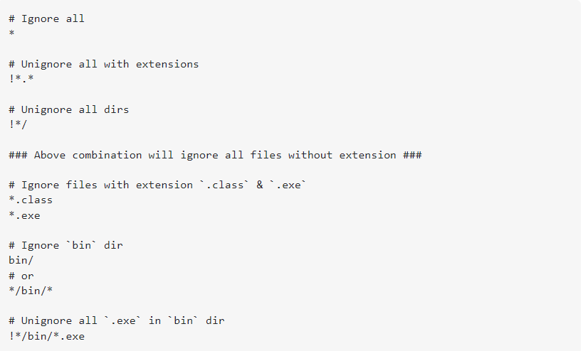
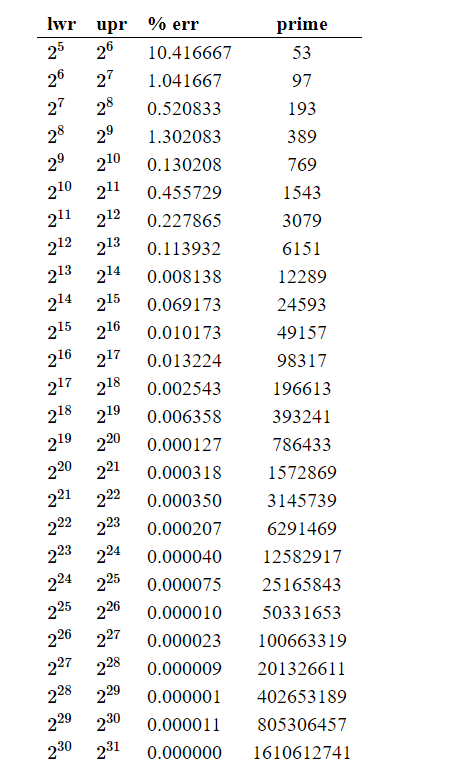

# Data Strcutures and Algorithms || C++

This repo contains all the questions and concepts of DSA I have read and solved. Topic/Concept name is given next to each code for better understanding.
The language used to solve and program the algorithms is C++ and C.

### Note: gitignore commands:

### Hashing - Prime values which improves it!

